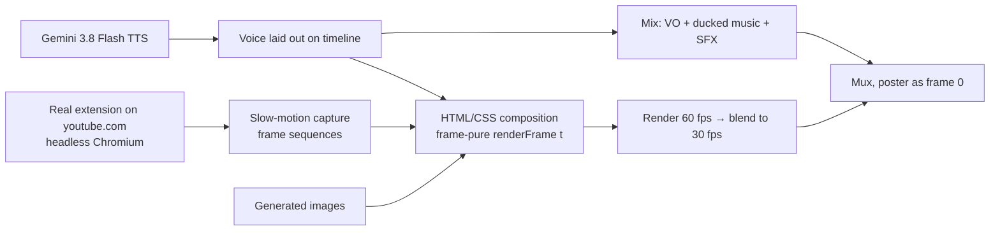

# YouTube Ultrawide Crop — demo video: making of

`youtube-ultrawide-crop-demo.mp4`: 42.6 s, 1920×1080, 30 fps, H.264 + AAC. It is attached to GitHub Release v1.1.2 as an asset, not committed to the repo:

```bash
gh release upload v1.1.2 "marketing/launch-film/youtube-ultrawide-crop-demo.mp4#YouTube Ultrawide Crop — demo video (1080p)"
```

It is a motion-designed product film with a voiceover. Every product moment in it is real footage of the built extension running on youtube.com. This document covers everything needed to reproduce it.

## Idea

The film follows the MarketFast launch video recipe: pain first, the product fast, no feature lists.

- **Pain:** a gorgeous film on YouTube with two fat black bars in a 21:9 player.
- **Product:** one tiny button, one real click, and the video fills the screen.
- **Proof:** it stays on across new videos, refreshes, theater mode and fullscreen, shown as one continuous browsing session.
- **Punchline:** "Just YouTube, using the screen you paid for."



## Storyboard (composition time)

| Time | Voiceover | Picture |
|---|---|---|
| 0.0–3.3 | "If you have an ultrawide monitor, you've seen this." | A floating dark browser rises onto the stage. YouTube theater mode, crop OFF, big black side bars. |
| 3.3–7.5 | "A 21:9 display… playing YouTube like it's 16:9." | Slow push in. An outline and "21:9 display" tag around the player, then "16:9 video" around the picture; hatched bars. |
| 7.5–10.75 | "So, I fixed it. YouTube Ultrawide Crop…" | The browser blurs and dims. Four corner brackets fly in and lock into the icon; the wordmark appears. |
| 10.75–13.9 | "…adds one tiny button, directly to the YouTube player." | The icon shrinks and flies onto the real crop button in the control bar (match cut at 11.5 s). The camera holds a close-up. |
| 13.9–15.05 | "Click it…" | The cursor glides onto the button (real hover). Real click at 15.05 s; the music drop lands here. |
| 15.05–18.3 | "…and the video instantly fills your ultrawide display." | The real crop snaps on. Fast pull back to the whole browser, with a flash and a ring. |
| 18.3–19.2 | "That's it." | Hold. |
| 19.2–21.8 | "Turn it on once, and it stays on across…" | Montage framing and a "Crop stays on" eyebrow pill. |
| 21.8–24.3 | "…NEW videos," | Label "New video". The cursor clicks YouTube's Next button → real navigation → *Caminandes 3* opens, still cropped. |
| 24.3–26.6 | "refreshes," | Label "Refresh". The cursor clicks the browser reload button → real reload (skeleton + spinner) → the same video returns, still cropped. |
| 26.6–28.9 | "theater mode," | Label "Theater mode". Same tab: click to normal mode, then click back to theater. The crop re-fits each time. |
| 28.9–30.8 | "and fullscreen." | Label "Fullscreen". Click on the fullscreen button; the browser chrome peels away into a bare ultrawide screen. The same playback continues. |
| 30.8–34.1 | "No account. No tracking. Nothing else to configure." | The same playback continues, blurred and dark; one line per phrase. |
| 34.1–37.4 | "Just YouTube, using the screen you paid for." | Unblur, then pull back to reveal the ultrawide monitor on a desk; caption. |
| 37.4–42.6 | "YouTube Ultrawide Crop. Free and open source." | End card: icon, wordmark, "Free and open source.", and Chrome Web Store · Firefox Add-ons · GitHub chips. |

## Visual identity
- **Colours** (from `src/popup/popup.css`): background `#0f0f0f`, surface `#1f1f1f`, border `#303030`, text `#f1f1f1`, accent `#ff0033`, on `#2ba640`.
- **Icon:** the exact SVG from `src/player/button.ts`. That is a `0 0 36 36` viewBox, four stroked corner paths (`M8 13V8h5`, `M23 8h5v5`, `M28 23v5h-5`, `M13 28H8v-5`, stroke 2.5, round caps), and a white 10×10 centre square (`rx 1`) for the ON state. Everything is white, as on the real button.
- **Type:** Inter Tight (display) and Inter (UI), self-hosted woff2.
- **Browser frame:** 1500×838 px, radius 14, a dark title bar with traffic lights, back/forward/reload and the URL. There is no extension icon in the toolbar; it read as a fullscreen button.
- **Generated images:**
  - A dark graphite stage backdrop with a soft crimson floor bloom and faint amber haze at the top corners.
  - A photoreal 34″ 21:9 monitor on a dark walnut desk at night, with warm bias lighting, shot frontally with the screen powered off. The screen rectangle gets replaced with the real fullscreen footage.
- **Finishing:** vignette, animated film grain (7% overlay), and 60 → 30 fps frame blending for motion blur.

## 1. Capture real footage
- **Browser:**
  - Build the extension (`bun run build`) and load `dist-chrome` plus uBlock Origin Lite (keeps ads out of shot) into headless Chromium with `--remote-debugging-port=9222 --autoplay-policy=no-user-gesture-required --mute-audio --no-sandbox`.
  - Drive it with `puppeteer-core`.
  - Set the cookie `PREF=f6=400&hl=en&gl=US` for the dark theme.
  - Inject CSS on every document that hides YouTube's end screens, cards, tooltips, bezels, ambient mode and the `#secondary` column.
  - Hide the player controls with a class toggle, except when a click is shown.
- **Viewport:** 1680×889 at 2× pixel density, which makes the theater player exactly 21:9 (1680×720). Fullscreen uses 1680×642 at 1.25× (2.617:1, the desk monitor's aspect).
- **Deterministic slow-motion capture:**
  - Set `video.playbackRate = 0.08` and screenshot as fast as possible.
  - Log `(wallclock, video.currentTime)` samples, and give each shot a media time from a local (±2 s) least-squares fit.
  - Resample to exact 30 fps in content time.
  - Re-apply the rate whenever YouTube resets it, and abort if media time stalls.
  - Scripted actions (hover, click, show/hide controls) fire when the content time crosses their mark, so real clicks line up with the drawn cursor and the voice.
  - Save the real control coordinates with each clip. The composition anchors the cursor and rings to them.
- **Session 1, hero + new video:**
  1. Open an anonymous playlist, `youtube.com/watch_videos?video_ids=aqz-KE-bpKQ,L6mLFxGRFI4` (*Big Buck Bunny*, then *Caminandes 3*), start at 54 s, theater mode, crop OFF.
  2. Record 21.55 s of content: controls show at 10.4, hover the crop button at 13.9, **click at 15.05**, controls hide at 16.8, controls show at 20.6, hover Next at 21.2.
  3. Click Next (real SPA navigation), captured in real time.
  4. Record 2.2 s of the new video.
- **Session 2, one continuous take on `watch?v=L6mLFxGRFI4` with crop ON:**
  1. Real `page.reload()`, captured with a **CDP screencast** (`Page.startScreencast`) because screenshots block during reload.
  2. After the reload, record 4.0 s (still at 2× density): controls at 1.25, click the theater button to **normal mode at 1.75**, click it again to **theater at 2.55**, hover fullscreen at 3.2.
  3. Keep the slow rate, click the real fullscreen button, switch the viewport to 1680×642 and record 8.8 s. The playback carries straight on, with no seek.
- **Seeking:** in headless sessions YouTube errors on long seeks, and on reloading an anonymous-playlist URL. Play fast (2×) up to a target instead, and reload the plain watch URL.

## 2. Voiceover
Gemini 3.8 Flash TTS through the **Interactions API**, voice **Puck**. The transcript is spoken verbatim; delivery goes in `speech_metadata.style`, and pauses are inline tags.

```bash
curl -s -X POST https://generativelanguage.googleapis.com/v1beta/interactions \
  -H "x-goog-api-key: $GEMINI_API_KEY" -H 'Content-Type: application/json' -d '{
  "model": "gemini-3.8-flash-tts",
  "input": [{"type":"user_input","content":[{"type":"text","text":"<TRANSCRIPT>",
    "annotations":[{"type":"speech_metadata","style":"<STYLE>"}]}]}],
  "response_format": {"type":"audio"},
  "generation_config": {"speech_config":[{"voice":"Puck"}]}}' \
| jq -r '[.steps[]|select(.type=="model_output")|.content[]|select(.type=="audio")]|last|.data' | base64 -d > take.wav
```

**Style:** `relaxed, confident young software founder casually showing a friend a small tool they genuinely like; conversational and understated, slightly playful; fairly quick pace but never rushed; not a commercial, radio or narrator voice`

**Main take transcript:**
```
If you have an ultrawide monitor, you've seen this. <short pause> A twenty-one by nine display... playing YouTube like it's sixteen by nine. <short pause> So, I fixed it. <short pause> YouTube Ultrawide Crop adds one tiny button, directly to the YouTube player. <short pause> Click it... <long pause> and the video instantly fills your ultrawide display. <short pause> That's it. <short pause> Turn it on once, and it stays on across videos, refreshes, theater mode, and fullscreen. <short pause> No account. No tracking. Nothing else to configure. <short pause> Just YouTube, using the screen you paid for. <short pause> YouTube Ultrawide Crop. <short pause> Free and open source.
```

**Montage line (separate take):** the transcript is `Turn it on once, and it stays on across NEW videos, <long pause> refreshes, <long pause> theater mode, <long pause> and fullscreen.` Append this to the style: `; say 'and it stays on across NEW videos' as one smooth, connected phrase with no pause before 'across'; reading a list of items, each item with a light, continuing, unfinished intonation until the last one; natural stress on the word NEW`.

- **Picking a take:** generate several.
  - Reject any with a silence of 120 ms or more inside the first phrase, or a falling pitch at the end of "new videos", "refreshes" or "theater mode". Only "and fullscreen" should fall.
  - NEW should be the loudest, highest syllable of its phrase. The chosen take peaked around 160 Hz.
  - Confirm with a Gemini audio review (3.6, 3.7 or 3.8 Flash; rotate when they return 503/429).
- **Assembly** onto the timeline, from a single file per piece with 10–20 ms fades at each cut:

| Source take | Source span (s) | Placed at (s) | Words |
|---|---|---|---|
| main | 0.00–14.95 | 0.30 | hook … "Click it" |
| main | 15.62–19.45 | 15.17 | "and the video instantly fills … That's it." (0.75 s trimmed after "Click it") |
| montage | 0.12–3.55 | 19.52 | "Turn it on once, and it stays on across NEW videos," |
| montage | 4.57–5.90 | 24.20 | "refreshes," |
| montage | 7.17–8.06 | 26.50 | "theater mode," |
| montage | 8.86–9.88 | 28.80 | "and fullscreen." |
| main | 25.45–34.88 | 30.86 | "No account." … "Free and open source." |

The source spans are for the takes we used. A new take needs its own silence detection to find them. With ffmpeg, use `adelay` followed by `apad=whole_dur`, not `atrim`: trimming after the delay drops the inserted silence.

**Free-tier limit:** 10 requests a day per project for `gemini-3.8-flash-tts`.

## 3. Composition
- **Page:** one 1920×1080 HTML page. `renderFrame(t)` sets every element as a pure function of `t` and awaits image decode and fonts. A headless page renders it.
- **Camera:** the browser sits in a "world" layer. The camera is keyframed `(zoom, focus x/y, screen x/y)` with cubic/quintic easing: slow push 1.0 → 1.2 over the hook; fly to 3.0× on the crop button at 11.5 s; 2.25–2.55× during the click; expo ease-out back to 1.0 at 16.35 s; montage framing at 1.0× with the browser nudged up so labels fit.
- **Key timings:**

| Moment | Time (s) |
|---|---|
| Guide lines draw | 3.55 and 6.0 |
| Brackets fly in | 7.53 |
| Wordmark | 9.1 |
| Icon flies to the button | 10.75 → 11.5 |
| Hover | 13.9 |
| Click | 15.05 |
| Montage label changes | 21.8, 24.3, 26.6, 28.9 |
| Montage clicks | 22.0, 24.5, 26.85 / 27.65, 29.1 |
| Benefit lines | 30.98, 31.73, 32.93 |
| Desk pull-back | 34.08 |
| End card | 37.43 |
| "Free and open source" | 38.93 |

- **Hero footage remap:** the hero clip reaches YouTube's Next button at 21.5 s of footage. Footage from 18.6–21.5 s is stretched slightly over 18.6–22.0 s so the Next click lands on "NEW videos".
- **Montage labels:** each label's exit finishes before the next label starts, so they never overlap.
- **Masks:** hide YouTube's recommendation column while the player is in normal mode.
- **Fullscreen morph:** the theater player rectangle becomes a bare 2.617:1 screen (0.75 s), then full frame (blurred 22 px, brightness 0.32 behind the benefit lines), then the desk monitor's screen rectangle. The footage stays at real-time speed throughout; slowing 24 fps content just holds frames and looks choppy.

## 4. Sound and final render
- **Music:** ende.app "Happy Beats / Business Moves Vol. 11", bundled with the [/brag skill](https://github.com/latent-spaces/brag).
  - Start it 1.81 s into the track, so its break falls on "Click it…" and the drop lands on the click.
  - Volume 0.42, 0.8 s fade in, 2.4 s fade out.
  - Side-chain ducked by the voice (`sidechaincompress threshold=0.035 ratio=5 attack=25 release=380`).
- **Voice:** highpass 70 Hz; compressor at threshold 0.12, ratio 2.5, makeup 1.6.
- **Effects:** Kenney CC0 clips, also bundled with /brag. Each gets a short `aecho 0.8:0.5:60:0.18`.

| Time (s) | Sound | Level |
|---|---|---|
| 7.50 | whoosh (pink noise 500–4200 Hz) | 0.10 |
| 11.50 | `interface/switch_002` | 0.22 |
| 15.03 | `ui/mouseclick1` | 0.55 |
| 15.10 | whoosh | 0.16 |
| 21.98, 24.48, 26.83, 27.63, 29.08 | `ui/mouseclick1` | 0.32 |
| 29.12 | whoosh | 0.08 |
| 34.03 | whoosh | 0.07 |
| 37.98 | `interface/select_008` | 0.20 |

- **Master:** `alimiter limit=0.89`, then `loudnorm I=-15 TP=-1.2 LRA=9`.
- **Video:** render at 60 fps; ffmpeg `tmix=frames=2` to 30 fps; `libx264 -crf 15 -pix_fmt yuv420p`.
- **Poster:** take the desk shot at 36.6 s and **replace** frame 0 with it (an overlay enabled on `n=0`), so the duration and A/V sync don't change. Mux AAC 192k with `-movflags +faststart`.

## Store listings (manual)
- **Chrome Web Store:** the listing video must be a YouTube link, set in Developer Dashboard → Store listing. The v2 API only handles upload, publish and status. Upload the MP4 to YouTube first.
- **Firefox Add-ons:** listing previews are PNG/JPEG only. Use a still from the film as the first preview and link the video in the description.

**Share copy:** Bought a 21:9 monitor, still watching YouTube with two fat black bars? YouTube Ultrawide Crop adds one tiny button to the player: click it once and every video fills the screen you paid for, across new videos, refreshes, theater mode and fullscreen. Free and open source for Chrome and Firefox.

## Credits
- **Footage:** *Big Buck Bunny* and *Caminandes 3: Llamigos* © Blender Foundation, CC BY.
- **Music:** ende.app, "Happy Beats / Business Moves Vol. 11".
- **Sound effects:** Kenney (CC0).
- **Voice:** Gemini 3.8 Flash TTS.
- YouTube Ultrawide Crop is not affiliated with YouTube, Google or Alphabet.
